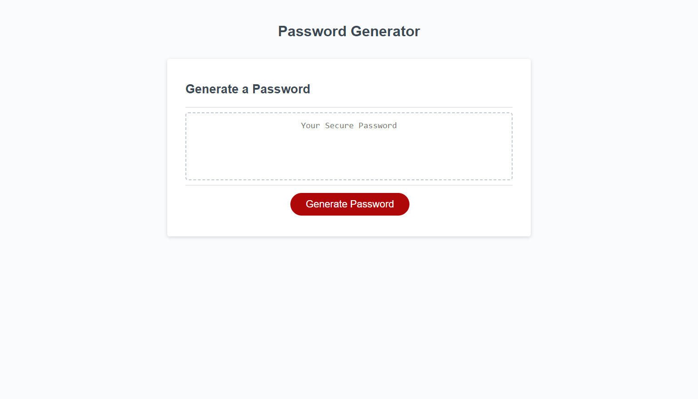

# passwordgen
Javascript Password generator 

## Description
My motivation for this project was to test my new skills in JavaScript. I built this project to create random passwords. This solved the problem of having to come up with a new password all of the time' I can input some information and I can get a random password. I learned that JavaScript is not an easy language. There are a lot of variables and positions that you have to keep track of.  

## Installation
None 

## Usage

Usage is available on the website. You can click the password prompts to get a random password. 

[link to deployed link](https://cmeinsig.github.io/passwordgen/)

## Credits

None 

## License

None
